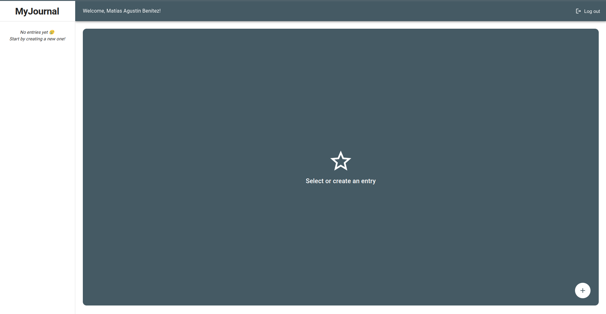
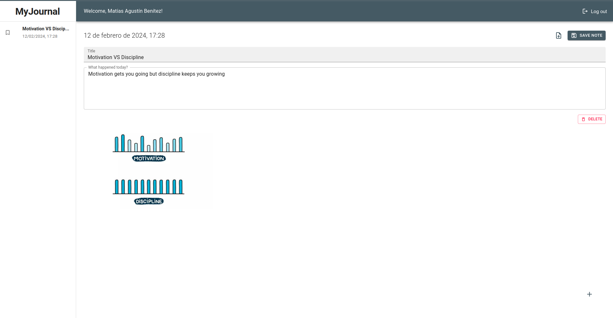
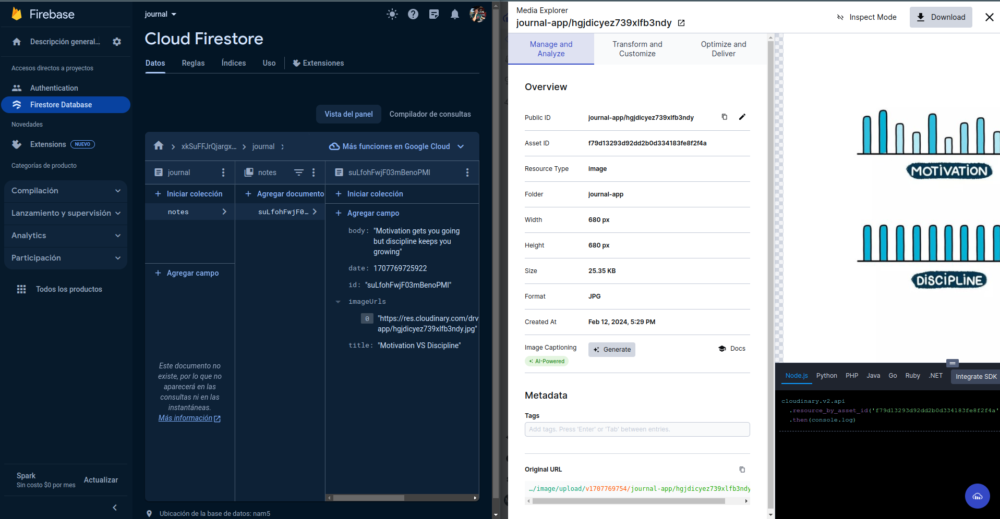

# MyJournal

MyJournal is a web application developed to provide users with a platform to store and manage their personal notes effectively. Leveraging Firebase authentication and Google Sign-In, users can securely access their accounts and safeguard their data.

## Features

- **Authentication**: Utilizes Firebase Authentication and Google Sign-In to ensure secure access for users.
- **Note Management**: Allows users to create, update, view, and delete their notes conveniently.
- **Image Uploads**: Enables users to upload images attached to their notes, utilizing Cloudinary for seamless storage.
- **Firestore Integration**: Utilizes Firestore database for efficient storage and retrieval of user notes.
- **React with Custom Hooks**: Developed using React.js, with custom hooks to enhance functionality and maintainability.

## Installation

To use MyJournal:

1. Clone the repository to your local machine.
2. Install dependencies using `npm install`.
3. Configure Firebase authentication and Cloudinary settings (explained before).
4. Run the application using `npm run dev`.
5. Access the application in your web browser.

## Create and complete .env file

``` shell
# FIREBASE CONFIG
VITE_API_KEY=
VITE_AUTH_DOMAIN=
VITE_PROJECT_ID=
VITE_STORAGE_BUCKET=
VITE_MESSAGING_SENDER_ID=
VITE_APP_ID=

# CLOUDINARY CONFIG
CLOUDINARY_URL=
CLOUDINARY_UPLOAD_PRESET=
```

## Contributions

Contributions to MyJournal are welcome! If you'd like to contribute:

1. Fork the repository.
2. Create your feature branch (`git checkout -b feature/YourFeature`).
3. Commit your changes (`git commit -m 'Add some feature'`).
4. Push to the branch (`git push origin feature/YourFeature`).
5. Open a pull request.

## Images





